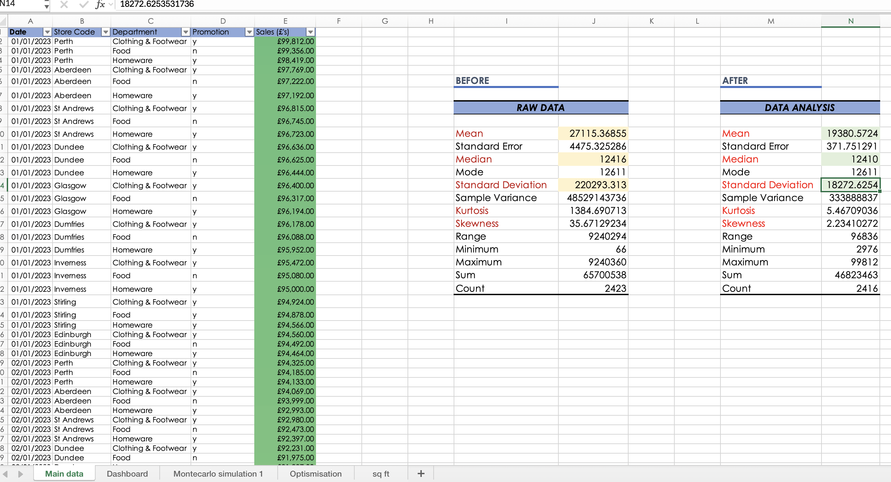
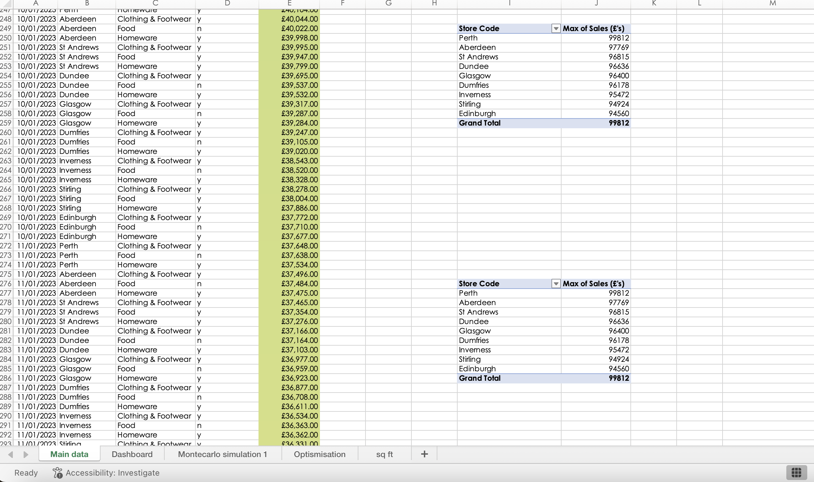
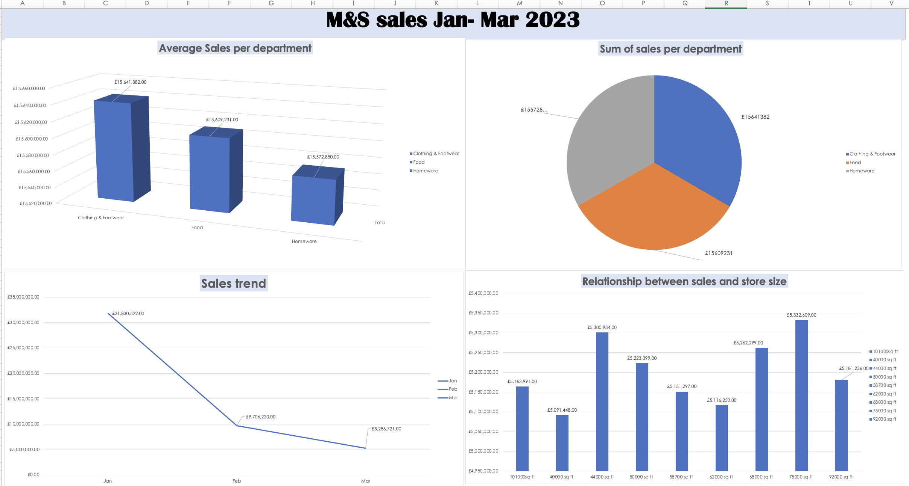
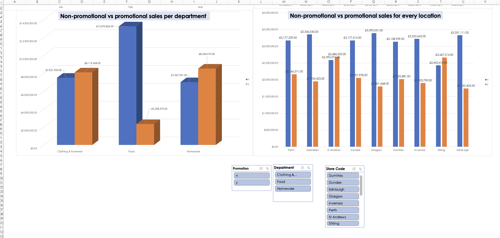
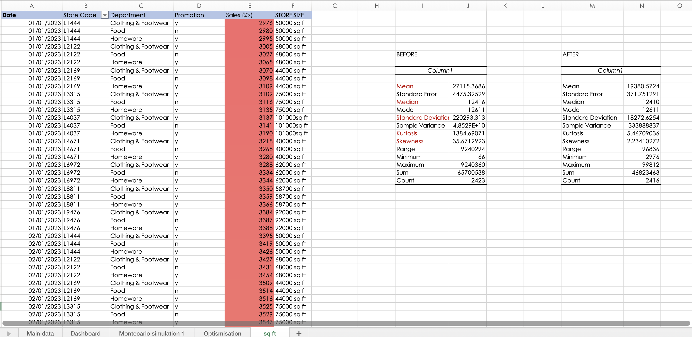
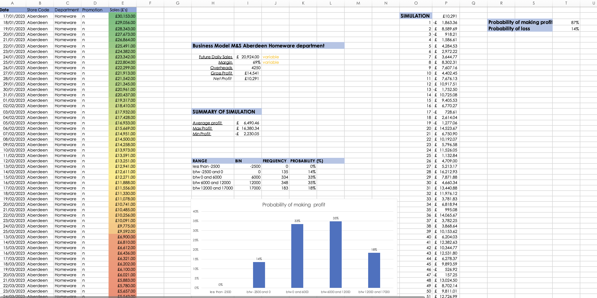
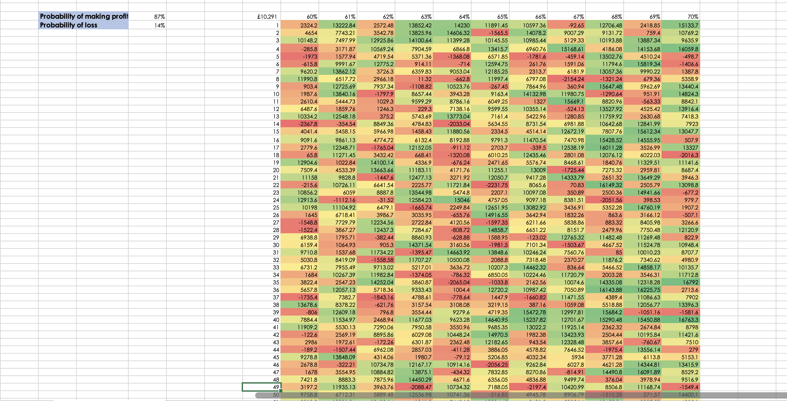
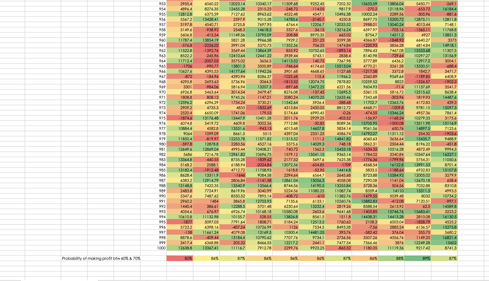
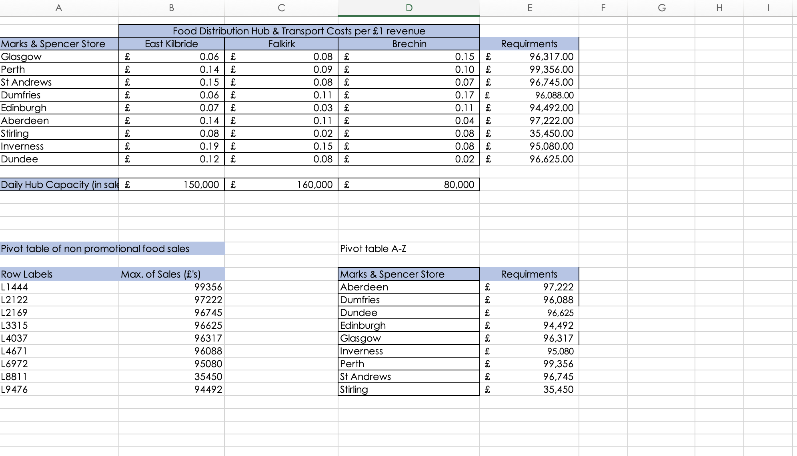

# Retail-Performance-Optimisation-M-S-Scotland-Case-Study
As a Business Analyst consultant for Marks &amp; Spencer, I developed an end-to-end analytics suite for the Regional Directors of Scotland. The project transitioned raw, "big data" into actionable insights across nine retail locations, focusing on sales performance, profitability risk modeling, and supply chain cost-minimisation.
# 📊 Retail Operations & Strategic Optimization: M&S Scotland

## 🎯 Executive Summary
This project delivers a robust analytical framework for Marks & Spencer’s regional leadership in Scotland. By integrating **Stochastic Risk Modeling** and **Linear Programming (Simplex LP)**, I developed a system to minimize logistics overheads and quantify financial risks across 9 key retail locations.

---
Project overview 

1. The Challenge
I was tasked with acting as a Consultant Analyst to evaluate the operational performance of 9 regional Marks & Spencer branches in Scotland. The business was facing three core problems:
* Data Integrity: Messy, high-variance sales data that made forecasting unreliable.
* Operational Risk: Uncertainty regarding the probability of daily profit vs. fixed overheads in specific locations (Aberdeen).
* Logistical Inefficiency: Rising transportation costs between regional hubs and the central distribution centre.
2. The Execution
I developed an end-to-end analytical solution using Advanced Excel and Power BI:
* Data Sanitisation (ETL): Built a Power Query pipeline to clean 3,000+ records, reducing data variance by 91% and eliminating outliers that were skewing performance metrics.
* Stochastic Modelling: Designed a 1,000-iteration Monte Carlo Simulation to stress-test the Aberdeen branch’s profitability, determining an 88.7% probability of meeting net profit targets.
* Prescriptive Analytics: Applied Linear Programming (Simplex LP) via Excel Solver to optimise the supply chain, successfully identifying a global minimum delivery cost of £30,548.
* Visualisation: Created an interactive Power BI Dashboard to visualise KPIs like Revenue per Square Foot and Promotional Lift, allowing stakeholders to drill down into departmental performance.
3. The Results & Key Learnings:
* Results: Identified £5k+ in potential logistical savings and provided a data-backed risk framework for regional expansion.
* Technical Learning: Mastered the use of Solver for optimisation and DAX for complex measures in Power BI.
* Business Learning: I learned how to translate "noisy" operational data into "Executive-Ready" insights, bridging the gap between raw numbers and strategic decision-making.

## 🛠️ 1. Data Integrity & ETL (Cleaning)
**The Challenge:** Raw sales data contained extreme variance (£220k+ Std. Dev), threatening the accuracy of regional forecasts.
**The Action:** Sanitized 3,000+ records and executed an outlier removal process.
**The Result:** Reduced Standard Deviation to £18k (a 91% increase in reliability) to ensure "Board-Ready" reporting.

---

## 🖥️ 2. Commercial Performance Dashboard
**The Challenge:** Stakeholders lacked a unified view of departmental sales vs. physical store capacity.
**The Action:** Built an interactive Executive Dashboard tracking promotional "lift" and revenue-per-square-foot efficiency.

---

## 🎲 3. Financial Risk Analysis (Monte Carlo)
**The Challenge:** Quantifying the probability of the Aberdeen branch failing to meet fixed daily overheads (£4,250).
**The Action:** Engineered a 1,000-iteration Monte Carlo simulation across variable gross margins (60-70%).
**The Result:** Identified an **88.7% probability of net profit**, providing a data-backed safety margin for management decisions.

---

## 🚚 4. Logistics & Supply Chain Optimization
**The Challenge:** Transportation costs from 3 Distribution Hubs to 9 Stores were unoptimized.
**The Action:** Utilized **Excel Solver** to find the global minimum cost while satisfying all store demand requirements.
**The Result:** Optimized the supply chain to a global minimum cost of **£30,548**.

---

## 📂 Project Assets
* [📊 Download the Full Excel Analytics Model](./Model/MS_Scotland_Retail_Analytics_Model.xlsb)

---

## 🔍 Critical Awareness
* **Stochastic Variables:** The current risk model assumes a normal distribution. Future versions could integrate seasonal weighting (e.g., Christmas surges) for higher precision.
* **Logistics Constraints:** The model assumes fixed fuel costs. Integrating a sensitivity table for energy price fluctuations would further robustify the supply chain plan.

---

## 🛠️ Technical Skills
* **Optimization:** Linear Programming (Excel Solver)
* **Risk Modeling:** Monte Carlo Simulations, Stochastic Analysis
* **Data Science:** Outlier Detection, ETL, Descriptive Statistics
* **Business Intelligence:** Dashboard Design, Stakeholder Reporting
